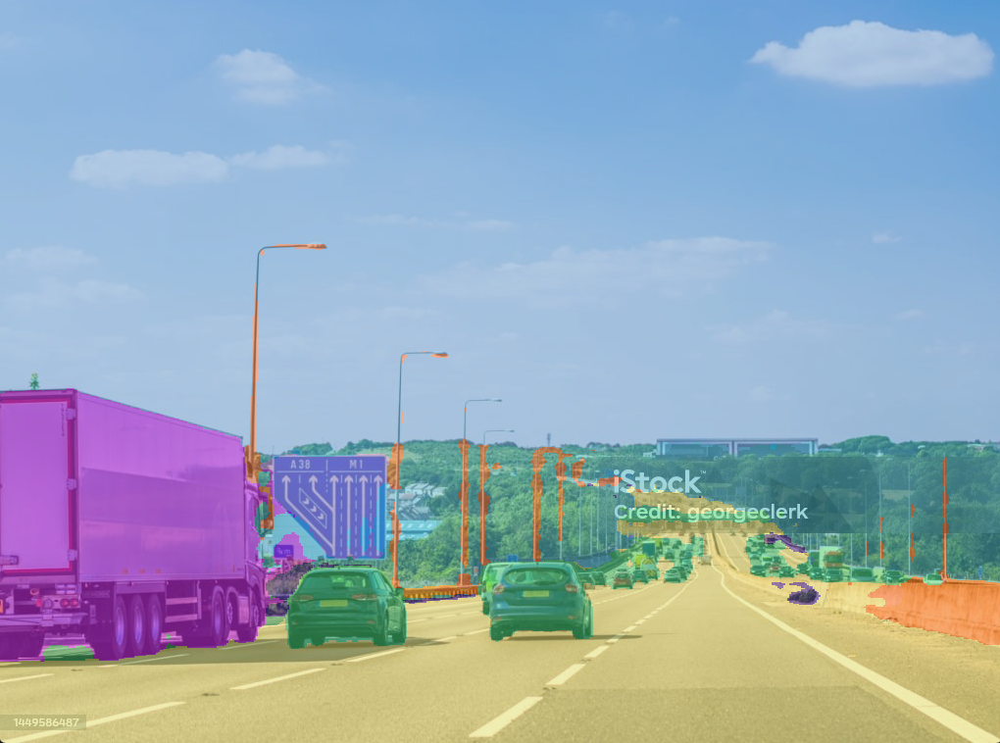
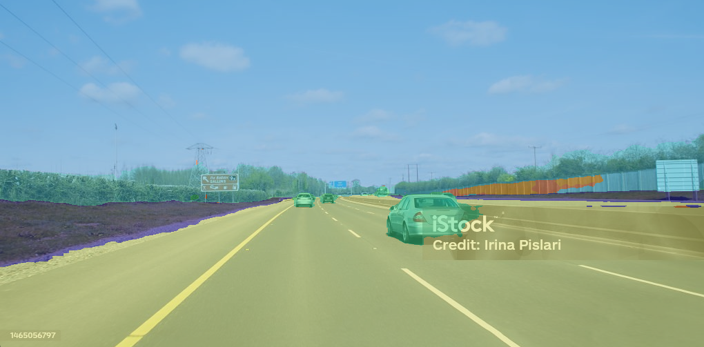
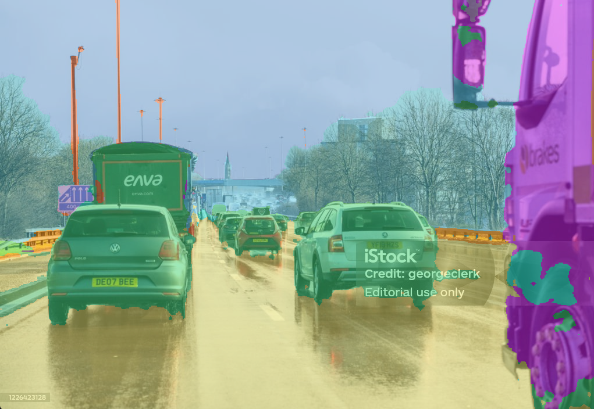
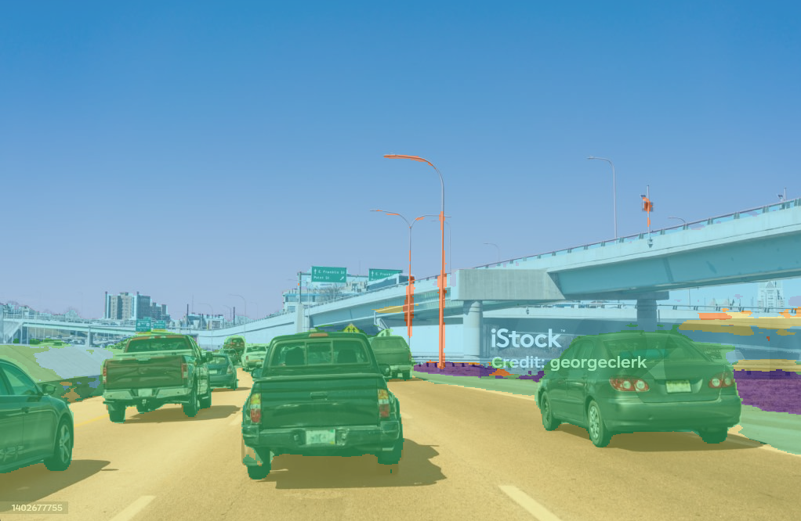

# 🚗 Autonomous Driving Semantic Segmentation using SegFormer

Deep learning project for **Autonomous Driving Semantic Segmentation** using **SegFormer** and **PyTorch**. The model performs pixel-level classification to identify different road scene objects such as roads, vehicles, pedestrians, buildings, vegetation, sky, and more.

---

## 📌 Project Overview

Semantic segmentation is a fundamental computer vision task for autonomous vehicles. Unlike image classification or object detection, semantic segmentation predicts a class for **every pixel** in an image, enabling a complete understanding of the driving environment.

This project fine-tunes a **SegFormer** model for multi-class semantic segmentation and demonstrates inference on real-world driving scenes.

---

## ✨ Features

* ✅ Transformer-based SegFormer architecture
* ✅ Multi-class semantic segmentation
* ✅ Pixel-wise classification
* ✅ Fine-tuning using PyTorch
* ✅ Data augmentation
* ✅ IoU evaluation metric
* ✅ Image inference
* ✅ Video inference
* ✅ Visualization of segmentation masks
* ✅ Resume-ready deep learning project

---

## 🛠 Tech Stack

* Python
* PyTorch
* Hugging Face Transformers
* OpenCV
* Albumentations
* NumPy
* Matplotlib

---

## 🧠 Model

* **Architecture:** SegFormer
* **Framework:** PyTorch
* **Task:** Multi-Class Semantic Segmentation

---

## 📂 Project Structure

```text
autonomous-driving-semantic-segmentation-segformer/
│
├── dataset/
├── models/
├── train.py
├── evaluate.py
├── inference.py
├── video_inference.py
├── utils.py
├── transforms.py
├── requirements.txt
├── README.md
│
├── demo/
│   └── images/
│       ├── segimg1.png
│       ├── segimg2.png
│       ├── segimg3.png
│       └── segimg4.png
```

---

## 📸 Demo Results

### Semantic Segmentation Examples

| Original / Prediction        |
| ---------------------------- |
|  |
|  |
|  |
|  |

---

## 📊 Evaluation

The model is evaluated using:

* Mean Intersection over Union (mIoU)
* Pixel-wise Semantic Segmentation

---

## 🚀 Installation

Clone the repository

```bash
git clone https://github.com/yourusername/autonomous-driving-semantic-segmentation-segformer.git

cd autonomous-driving-semantic-segmentation-segformer
```

Install dependencies

```bash
pip install -r requirements.txt
```

---

## 🏋️ Training

```bash
python train.py
```

---

## 📈 Evaluation

```bash
python evaluate.py
```

---

## 🎥 Inference

Image

```bash
python inference.py
```

Video

```bash
python video_inference.py
```

---

## 📚 Concepts Used

* Semantic Segmentation
* Vision Transformers
* SegFormer
* Transfer Learning
* Fine-Tuning
* Data Augmentation
* Pixel-wise Classification
* Mean IoU
* Computer Vision
* Deep Learning

---

## 🎯 Applications

* Autonomous Vehicles
* Driver Assistance Systems (ADAS)
* Robotics
* Smart Transportation
* Intelligent Traffic Monitoring
* Road Scene Understanding

---

## 📌 Future Improvements

* Improve segmentation boundary quality
* Increase dataset size
* Real-time inference optimization
* Mixed Precision (FP16) training
* ONNX/TensorRT deployment
* Quantization for edge devices

---

## 👨‍💻 Author

**Sami Khan**

AI / Machine Learning Engineer

Passionate about Computer Vision, Deep Learning, and building intelligent vision systems.
